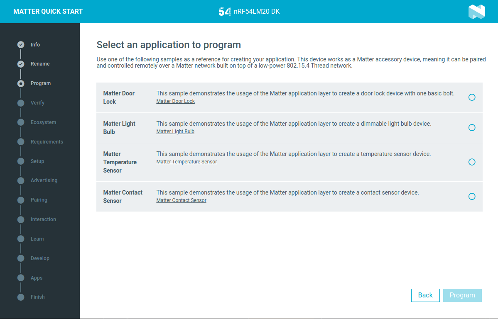
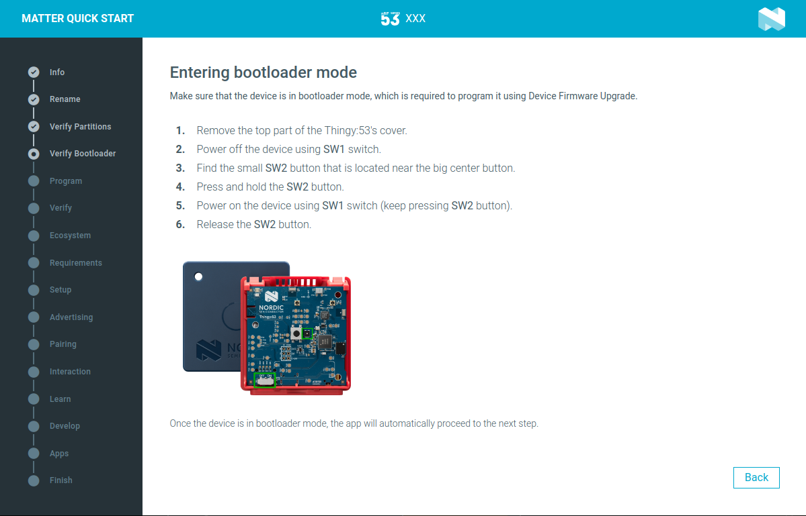
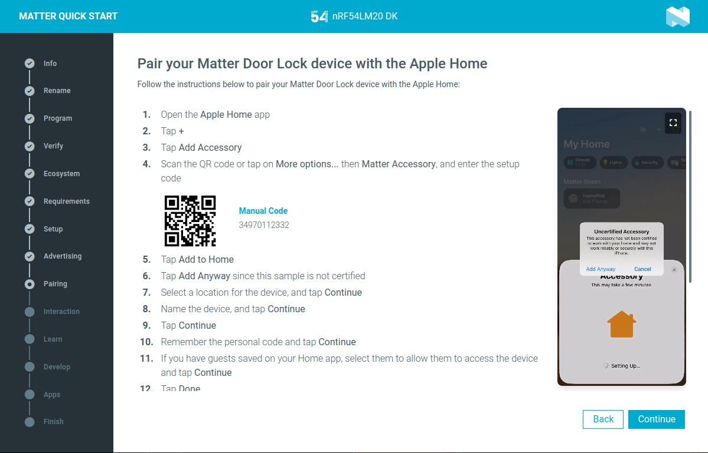
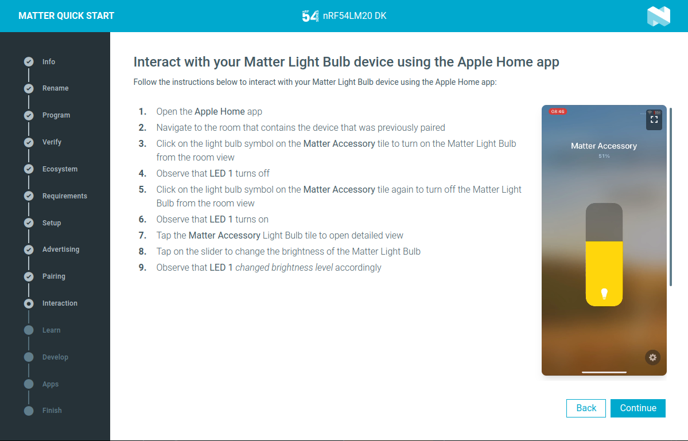

# {{app_name}}

The {{app_name}} is a cross-platform tool for guided setup and installation procedures of Matter accessory devices, available as one of the applications in [nRF Connect for Desktop](https://docs.nordicsemi.com/bundle/nrf-connect-desktop/page/index.html).

??? info "What is Matter"

    [Matter](https://buildwithmatter.com/) is an open-source connectivity standard for smart home and IoT devices. Developed by the Connectivity Standards Alliance (CSA), Matter aims to enable secure, reliable, and seamless communication between a wide range of devices from different manufacturers. It is designed to work over common networking technologies such as Ethernet, Wi-Fi, and Thread, and supports integration with major smart home ecosystems.

    For more information about Matter in the {{NCS}}, refer to the [Matter documentation](https://docs.nordicsemi.com/bundle/ncs-latest/page/nrf/protocols/matter/index.html).

??? info "What is Matter accessory device"

    To work with the Matter protocol, accessory devices such as sensors, lights, or door locks must be paired with a Matter controller device, which is usually a smart hub or mobile device. Setting up the ecosystem and pairing accessory devices is a required step in the process, and it is often a point where users encounter difficulties.

## Overview

The {{app_name}} is designed to guide you through the steps required for setting up a Matter accessory device.

The application supports the following features:

- Programming your device with several pre-compiled Matter sample applications for quick evaluation.
- Verifying the device output to ensure correct operation after programming.
- Step-by-step instructions for setting up [supported smart home ecosystems](#supported-ecosystems).
- Guidance on pairing your Matter accessory device and controlling it within your chosen ecosystem.
- Links to learning resources and tools for Matter product development with Nordic Semiconductor devices.

## Installation

You can run the {{app_name}} when you [download and install nRF Connect for Desktop](https://www.nordicsemi.com/Products/Development-tools/nRF-Connect-for-Desktop/Download).

## Supported devices

After installing and opening the app from nRF Connect for Desktop, connect one of the following supported devices to your machine using an USB cable and follow the steps in the app.

| Device | Supported Matter samples or applications |
|--------|-------------------------|
| nRF54L15 DK nRF54LM20 DK nRF5340 DK nRF52840 DK | Any of the following samples: - [Matter Door Lock](https://docs.nordicsemi.com/bundle/ncs-latest/page/nrf/samples/matter/lock/README.html) - [Matter Light Bulb](https://docs.nordicsemi.com/bundle/ncs-latest/page/nrf/samples/matter/light_bulb/README.html) - [Matter Temperature Sensor](https://docs.nordicsemi.com/bundle/ncs-latest/page/nrf/samples/matter/temperature_sensor/README.html) - [Matter Contact Sensor](https://docs.nordicsemi.com/bundle/ncs-latest/page/nrf/samples/matter/contact_sensor/README.html) |
| Nordic Thingy:53* | [Matter Weather Station](https://docs.nordicsemi.com/bundle/ncs-latest/page/nrf/applications/matter_weather_station/README.html) application |

??? info "* Programming Nordic Thingy:53"
    Nordic Thingy:53 does not have an on-board J-Link programmer. For this reason, you can only program the device through Device Firmware Upgrade (DFU) over USB. The {{app_name}} provides step-by-step guidance for putting the Thingy:53 into the bootloader mode and verifies that the memory partitions are compatible with the selected firmware before the upload.

    

## Supported ecosystems

The {{app_name}} supports the following ecosystems:

- Apple Home
- Google Home
- Amazon Alexa
- Samsung SmartThings

!!! note "Note"

    Commercial smart home ecosystems do not support all Matter device types described by the Matter specification. When you select a specific Matter sample firmware, the application only displays ecosystems that are compatible and support that particular device type. This means that the list of available ecosystems may vary depending on your sample selection.

### Ecosystem requirements

Each commercial ecosystem requires specific devices, like a smart speaker or hub and a compatible mobile application to enable Matter functionality.

The {{app_name}} informs you about the required devices, as well as the necessary mobile application. The app also presents step-by-step instructions to help you prepare your ecosystem to work with Matter accessories, including videos recorded from the actual mobile applications.

### Ecosystem pairing requirements

Each commercial ecosystem requires specific mobile applications for pairing and controlling the Matter accessory device.

The {{app_name}} informs you about the required mobile applications. Once you have selected and set up your preferred ecosystem, you can proceed to pair your Matter accessory device with the corresponding mobile application. The information provided is tailored for each supported ecosystem and every available Matter sample.

### Ecosystem testing

Testing the Matter device type is different for each ecosystem.

For each device type, the {{app_name}} provides information about how to interact with the device after pairing. For example, if you are using a Matter Light Bulb, the app will show how to adjust brightness and toggle the light on or off.

## Application source code

The code of the application is open source and [available on GitHub](https://github.com/NordicSemiconductor/pc-nrfconnect-matter-quickstart).
Feel free to fork the repository and clone it for secondary development or feature contributions.
